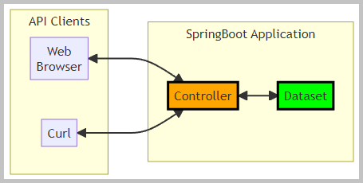
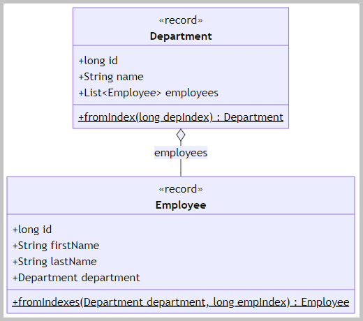
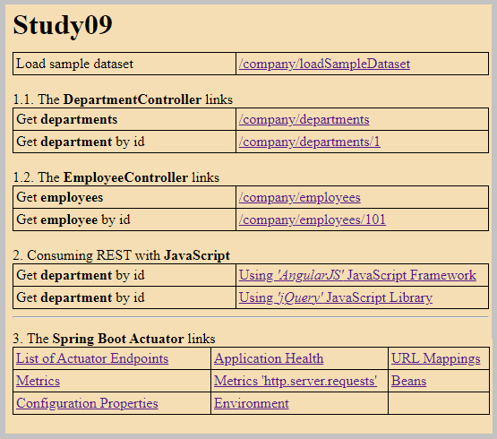
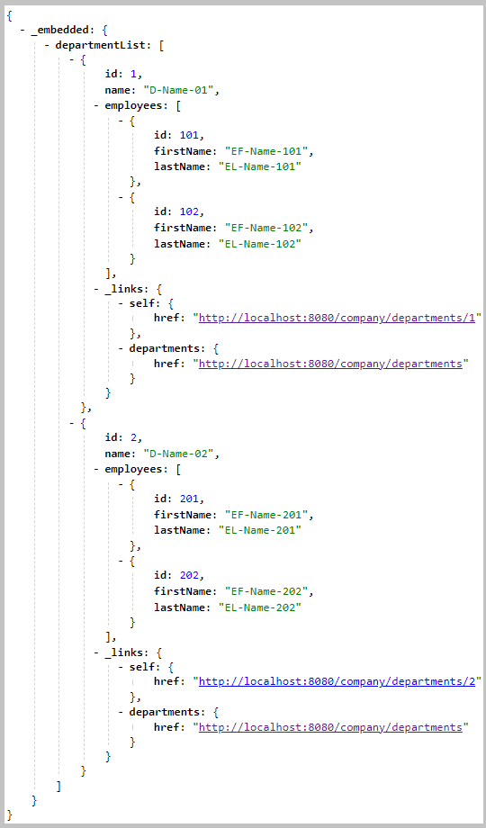
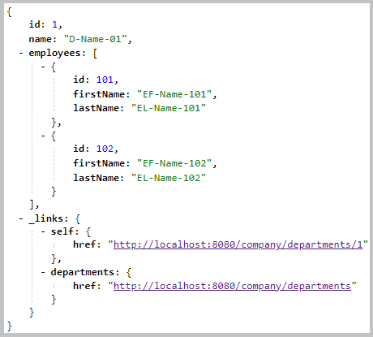
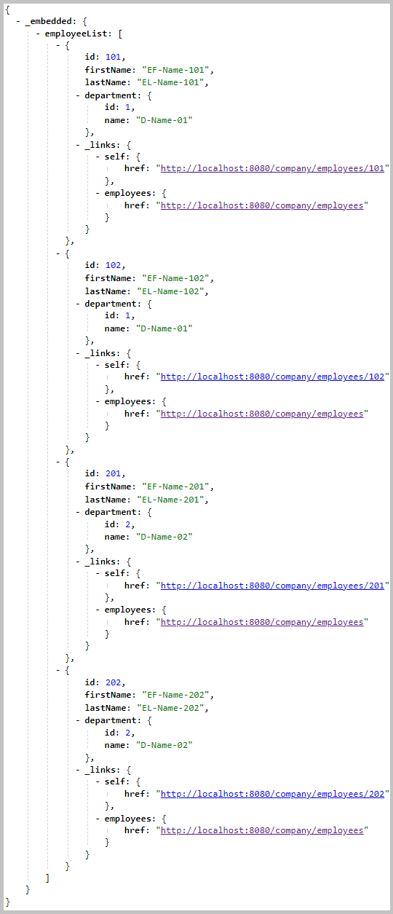
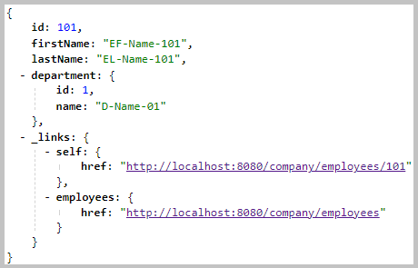
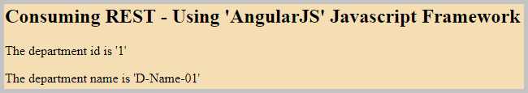
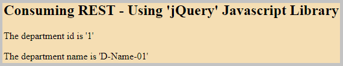

<!DOCTYPE html>
<html lang="en">
<meta charset="UTF-8">
<body>

<h2 id="contents">Study09 README Contents</h2>
<h3 id="top">Research the <a href="https://docs.spring.io/spring-framework/reference/web/webmvc.html">Spring Web MVC</a>
with JavaScript libraries <a href="https://angularjs.org/">AngularJS</a> and <a href="https://jquery.com/">jQuery</a></h3>

 

<i>The flowchart with the Spring Boot application.</i>

The <a href="https://github.com/k1729p/Study09/blob/main/src/main/java/kp/SampleDataset.java">Sample Dataset</a> 
stores the data in the Java object 'List&lt;Department&gt;'.

This is the <a href="https://docs.spring.io/spring-framework/reference/web/webmvc.html">Spring Web MVC</a> and
<a href="https://spring.io/projects/spring-hateoas">Spring HATEOAS</a> application with HAL representations of each resource. 
The HATEOAS RESTful web service controllers: 
<a href="https://github.com/k1729p/Study09/blob/main/src/main/java/kp/company/controller/DepartmentController.java">
DepartmentController</a> and
<a href="https://github.com/k1729p/Study09/blob/main/src/main/java/kp/company/controller/EmployeeController.java">
EmployeeController</a>.

The sections of this project:

<ol>
<li><a href="#ONE"><b>Spring Boot Server</b></a></li>
<li><a href="#TWO"><b>Web Browser Client</b></a></li>
<li><a href="#THREE"><b>Curl Client</b></a></li>
</ol>

Java source code. Packages: 
 

    <i>application sources</i>&nbsp;:&nbsp;
	<a href="https://github.com/k1729p/Study09/tree/main/src/main/java/kp">kp</a> 

    <i>test sources</i>&nbsp;:&nbsp;
	<a href="https://github.com/k1729p/Study09/tree/main/src/test/java/kp">kp</a> 

 

<i>The domain objects class diagram.</i>

<ul>
<li>
The <a href="https://github.com/k1729p/Study09/blob/main/src/main/java/kp/company/assembler/DepartmentAssembler.java">
DepartmentAssembler</a> converts the
<a href="https://github.com/k1729p/Study09/blob/main/src/main/java/kp/company/domain/Department.java">Department</a>
into an '<i>org.springframework.hateoas.RepresentationModel</i>'.
</li>
<li>
The <a href="https://github.com/k1729p/Study09/blob/main/src/main/java/kp/company/assembler/EmployeeAssembler.java">
EmployeeAssembler</a> converts the
<a href="https://github.com/k1729p/Study09/blob/main/src/main/java/kp/company/domain/Employee.java">Employee</a>
into an '<i>org.springframework.hateoas.RepresentationModel</i>'.
</li>
</ul>

The link to the <a href="https://docs.spring.io/spring-hateoas/docs/current/reference/html/#fundamentals.representation-models">
Representation Models</a> page (from the Spring HATEOAS Reference Documentation)
with the <b>RepresentationModel</b> class hierarchy diagram.

 

    <a href="http://htmlpreview.github.io/?https://github.com/k1729p/Study09/blob/main/docs/apidocs/index.html">
	Java API Documentation</a>&nbsp;●&nbsp;
    <a href="http://htmlpreview.github.io/?https://github.com/k1729p/Study09/blob/main/docs/testapidocs/index.html">
	Java Test API Documentation</a> 

<h3 id="ONE">❶ Spring Boot Server</h3>

Action: 
 
 1. With batch file 
<a href="https://github.com/k1729p/Study09/blob/main/0_batch/01%20MVN%20clean%20install%20run.bat"> 
<i>"01 MVN clean install run.bat"</i></a> build and start the Spring Boot Server. 

 
1.1. Application tests. Test classes are annotated with the <i>@SpringBootTest</i> annotation.

<ul>
<li>The <a href="https://github.com/k1729p/Study09/tree/main/src/test/java/kp/company/controller/client/side">client-side tests</a>.
    <ul>
        <li>Tests use <b>TestRestTemplate</b>.</li>
        <li>The Spring Boot server is STARTED.</li>
    </ul>
</li>
<li>The <a href="https://github.com/k1729p/Study09/tree/main/src/test/java/kp/company/controller/mvc">tests with server-side support</a>.
    <ul>
        <li>Tests use the Spring MVC Test Framework, also known as <b>MockMvc</b>.</li>
        <li>The Spring Boot server is NOT STARTED.</li>
    </ul>
</li>
</ul>

<a href="#top">Back to the top of the page</a>

<h3 id="TWO">❷ Web Browser Client</h3>

Action: 
 
 1. With the URL <a href="http://localhost:8080">http://localhost:8080</a> 
open in the web browser the '<i>home page</i>'. 
 2. On this '<i>home page</i>' select '<i>Load sample dataset</i>' 

 
2.1. The '<i>home page</i>' file <b>index.html</b>: 
<a href="https://github.com/k1729p/Study09/blob/main/src/main/resources/static/index.html">HTML code</a>, 
<a href="http://htmlpreview.github.io/?https://github.com/k1729p/Study09/blob/main/src/main/resources/static/index.html">
HTML preview</a>

 

<i>The screenshot of the home page.</i>

 
2.2. The DepartmentController endpoints.

2.2.1. Get all <b>departments</b>: 
<a href="http://localhost:8080/company/departments">/company/departments</a> 
The controller GET method: 
<a href="https://github.com/k1729p/Study09/blob/main/src/main/java/kp/company/controller/DepartmentController.java#L82">
kp.company.controller.DepartmentController::findAllDepartments</a>.

 

<i>The result from the endpoint 'Get all <b>departments</b>'.</i>

2.2.2. Get the <b>department</b> by id:
<a href="http://localhost:8080/company/departments/1">/company/departments/1</a> 
The controller GET method: 
<a href="https://github.com/k1729p/Study09/blob/main/src/main/java/kp/company/controller/DepartmentController.java#L63">
kp.company.controller.DepartmentController::findDepartmentById</a>.

 

<i>The result from the endpoint 'Get the <b>department</b> by id'.</i>

 
2.3. The EmployeeController endpoints

2.3.1. Get the <b>employees</b>: 
<a href="http://localhost:8080/company/employees">/company/employees</a> 
The controller GET method: 
<a href="https://github.com/k1729p/Study09/blob/main/src/main/java/kp/company/controller/EmployeeController.java#L89">
kp.company.controller.EmployeeController::findAllEmployees</a>.

 

<i>The result from the endpoint 'Get the <b>employees</b>'.</i>

2.3.2. Get the <b>employees</b> by id:
<a href="http://localhost:8080/company/employees/101">/company/employees/101</a> 
The controller GET method: 
<a href="https://github.com/k1729p/Study09/blob/main/src/main/java/kp/company/controller/EmployeeController.java#L71">
kp.company.controller.EmployeeController::findEmployeeById</a>.

 

<i>The result from the endpoint 'Get the <b>employees</b> by id'.</i>

 
2.4. Consuming REST with JavaScript

2.4.1. Get the <b>department</b> by id: 
<a href="http://localhost:8080/ConsumingRestUsingAngularJS/index.html">using the 'AngularJS' JavaScript framework</a>. 
File <a href="https://github.com/k1729p/Study09/blob/main/src/main/resources/static/ConsumingRestUsingAngularJS/index.html">index.html</a>.

 

<i>The result from the endpoint 'Using 'AngularJS' JavaScript framework'.</i>

2.4.2. Get the <b>department</b> by id: 
<a href="http://localhost:8080/ConsumingRestUsingJQuery/index.html">using the 'jQuery' JavaScript library</a>. 
File <a href="https://github.com/k1729p/Study09/blob/main/src/main/resources/static/ConsumingRestUsingJQuery/index.html">index.html</a>.

 

<i>The result from the endpoint 'Using 'jQuery' JavaScript library'</i>

2.5. The <a href="https://docs.spring.io/spring-boot/docs/current/reference/html/actuator.html">Spring Boot Actuator</a> 
creates the endpoints for monitoring and managing the application. 
The <a href="images/ScreenshotListOfActuatorEndpoints.png">
<b>screenshot</b></a> of the link '<a href="http://localhost:8080/actuator">List of actuator endpoints</a>'. 

<a href="#top">Back to the top of the page</a>

<h3 id="THREE">❸ Curl Client</h3>

Action: 
 
 1. With batch file
 <a href="https://github.com/k1729p/Study09/blob/main/0_batch/02%20CURL%20CRUD.bat">
 <i>"02 CURL CRUD.bat"</i></a> create, read, update, and delete departments and employees. 
 2. With batch file
 <a href="https://github.com/k1729p/Study09/blob/main/0_batch/03%20CURL%20load%20and%20read.bat">
 <i>"03 CURL load and read.bat"</i></a> load the sample dataset and get departments and employees. 
 

3.1. The console log screenshots from the run of the batch file "02 CURL CRUD.bat".

3.1.1. The <a href="images/ScreenshotCurlCrudCreate.png">
<b>screenshot</b></a> of "<i>CREATE</i>" and "<i>READ by id - after CREATE</i>" steps. 
The controller POST method for 'CREATE': 
<a href="https://github.com/k1729p/Study09/blob/main/src/main/java/kp/company/controller/DepartmentController.java#L45">
kp.company.controller.DepartmentController::createDepartment</a>. 
<a href="https://github.com/k1729p/Study09/blob/main/src/main/java/kp/company/controller/EmployeeController.java#L47">
kp.company.controller.EmployeeController::createEmployee</a>.

3.1.2. The <a href="images/ScreenshotCurlCrudUpdate.png">
<b>screenshot</b></a> of "<i>UPDATE by id</i>" and "<i>READ by id - after UPDATE</i>" steps. 
The controller PATCH method for 'UPDATE by id': 
<a href="https://github.com/k1729p/Study09/blob/main/src/main/java/kp/company/controller/DepartmentController.java#L99">
kp.company.controller.DepartmentController::updateDepartment</a>. 
<a href="https://github.com/k1729p/Study09/blob/main/src/main/java/kp/company/controller/EmployeeController.java#L105">
kp.company.controller.EmployeeController::updateEmployee</a>.

3.1.3. The <a href="images/ScreenshotCurlCrudDelete.png">
<b>screenshot</b></a> of "<i>DELETE by id</i>" and "<i>READ by id - after DELETE</i>" steps. 
The controller DELETE method for 'DELETE by id': 
<a href="https://github.com/k1729p/Study09/blob/main/src/main/java/kp/company/controller/DepartmentController.java#L123">
kp.company.controller.DepartmentController::deleteDepartment</a>. 
<a href="https://github.com/k1729p/Study09/blob/main/src/main/java/kp/company/controller/EmployeeController.java#L136">
kp.company.controller.EmployeeController::deleteEmployee</a>.

3.2. The console log screenshots from the run of the batch file "03 CURL load and read.bat". 

3.2.1. The <a href="images/ScreenshotCurlLoadSampleDataset.png">
<b>screenshot</b></a> of the "<i>Load sample dataset</i>" step. 

3.2.2. The <a href="images/ScreenshotCurlGetOne.png">
<b>screenshot</b></a> of the "<i>GET one department</i>" and the "<i>GET one employee</i>" steps. 

3.2.3. The <a href="images/ScreenshotCurlGetAll.png">
<b>screenshot</b></a> of the "<i>GET all departments</i>" and the "<i>GET all employees</i>" steps. 

<a href="#top">Back to the top of the page</a>

<h3>Dictionary</h3>
<table style="border:solid">
<tbody>
<tr><td style="border:solid"><b>HAL</b></td><td style="border:solid">Hypertext Application Language</td></tr>
<tr><td style="border:solid"><b>HATEOAS</b></td><td style="border:solid">Hypermedia As The Engine Of Application State</td></tr>
<tr><td style="border:solid"><b>REST</b></td><td style="border:solid">Representational State Transfer</td></tr>
</tbody>
</table>
<a href="#top">Back to the top of the page</a>

</body>
</html>