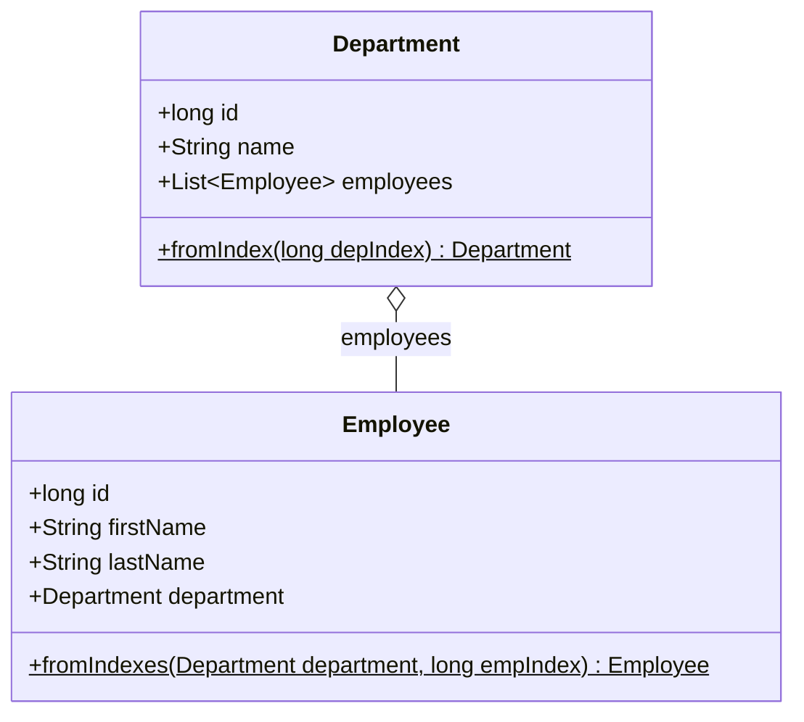

```mermaid
classDiagram
direction TD
class Department {
 +long id
 +String name
 +List~Employee~ employees
 +fromIndex(long depIndex)$ Department
}
class Employee {
 +long id
 +String firstName
 +String lastName
 +Department department
 +fromIndexes(Department department, long empIndex)$ Employee
}
Department o-- Employee : employees
```